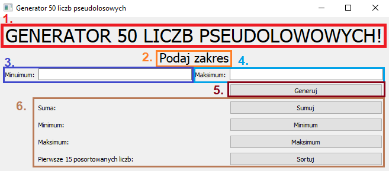
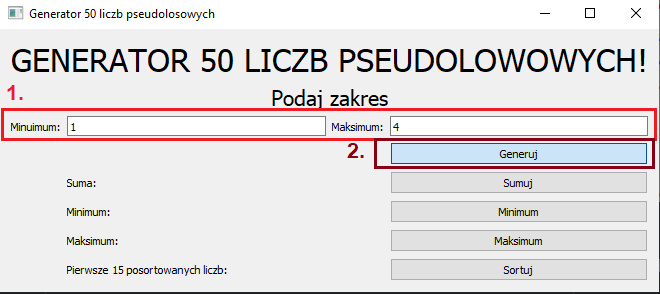
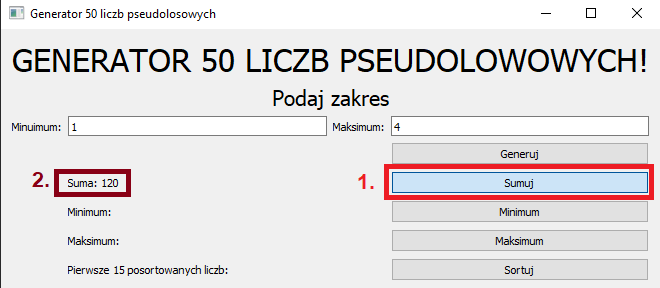
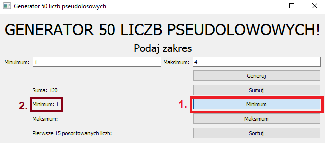
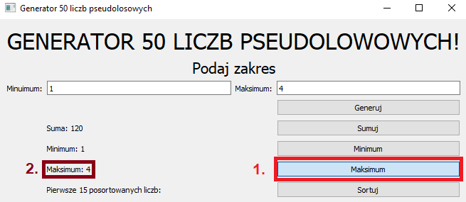
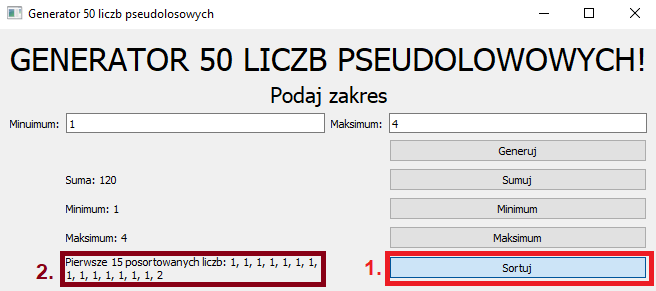
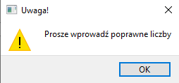
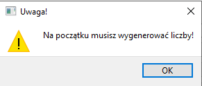
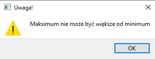

# Generator 50 liczb pseudolosowych

## Spis treści
1. [Opis programu](#opis-programu)
2. [Instrukcja obsługi](#instrukcja-obsługi)
   - [Wybór zakresu liczb](#Wybór-zakresu-liczb)
   - [Obliczanie sumy](#Obliczanie-sumy)
   - [Wyszukiwanie maksimum](#Wyszukiwanie-maksimum)
   - [Wyszukiwanie minimum](#Wyszukiwanie-minimum)
   - [Sortowanie liczb](#Sortowanie-liczb)
3. [Zabezpieczenia](#Zabezpieczenia)

## Opis programu
Generator 50 liczb pseudolosowych to prosta aplikacja desktopowa, która generuje, zlicza, sortuje i wyświetla losowe liczby. Aplikacja po uruchomieniu zawiera:
1. Etykiete z nazwą programu czyli: "Generator 50 liczb pseudolosowych"
2. Etykiete z napisem: "Podaj zakres"
3. Pole edycyjne z Etykietą Minimum
4. Pole edycyjne z Etykietą Maksimum
5. Przyciek o nazwie generuj
6. 4 przyciski z etykietami kolejno
   - Etykieta o nazwie "Suma" i przycisk o nazwie "Sumuj"
   - Etykieta i przycisk o nazwie "Minimum"
   - Etykieta i przycisk o nazwie "Maksimum"
   - Etykieta o nazwie "Pierwsze 15 posortowanych liczb" i przycisk o nazwie "Sortuj"

Aplikacja została stworzona przy użyciu:

Program po uruchomieniu:

## Instrukcja obsługi

### Wybór zakresu liczb
1. Wprowadź dolną i górną granicę zakresu liczb w polach edycyjnych.
2. Kliknij przycisk "Generuj", aby wygenerować 50 losowych liczb z wybranego zakresu.

 Uwaga jeśli przy etykietach "Suma", "Minimum", "Maksimum" lub "Pierwsze 15 posortowanych liczb" znajdują się wyniki a przycisk generuj zostanie kilknięty ponownie dane zostaną usunięte!!!  

### Obliczanie sumy
1. Kliknij przycisk "Sumuj", aby obliczyć sumę wygenerowanych liczb.
2. Wynik zostanie wyświetlony obok etykiety "Suma".

### Wyszukiwanie minimum

1. Kliknij przycisk "Minimum", aby znaleźć najmniejszą liczbę w wygenerowanym zestawie.
2. Wynik zostanie wyświetlony obok etykiety "Minimum".

### Wyszukiwanie maksimum

1. Kliknij przycisk "Maksimum", aby znaleźć największą liczbę w wygenerowanym zestawie.
2. Wynik zostanie wyświetlony obok etykiety "Maksimum".

### Sortowanie liczb

1. Kliknij przycisk "Sortuj", aby posortować wygenerowane liczby.
2. Pierwsze 15 liczb zostanie wyświetlonych  obok etykiety "Pierwsze 15 posortowanych liczb".

### Zabezpieczenia
Aplikacja ma zabezpieczenia, które uniemożliwiają obliczanie sumy, wyszukiwanie maksimum i minimum, jeśli liczby nie zostały jeszcze wygenerowane, w przypadku podania niepoprawnych liczb, oraz w przypadku kiedy maksimum będzie większe od minimum. W takim przypadku, wyświetlany będzie komunikat ostrzegawczy.

Komunikat w przypadku braku podanego zakresu liczb lub w przypadku podaniu nieprawidłowych liczb (liter lub znaków sepcjalnych):

Komunikat w przypadku próby sumowania, szukania minimum lub maksimum, lub sortowania przy jednoczesnym braku wygenerowanych liczb:

Komunikat w przypadku kiedy Minimum jest większe od Maksimum:

